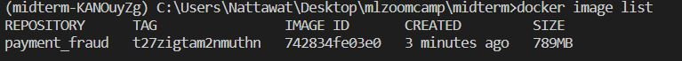

# **mlzoomcamp midterm project**
This project is a midterm project of Machine Learning Zoomcamp Course. The goal of this project is to build a ML model for fraud prediction.

Find more : [mlzoomcamp](https://github.com/alexeygrigorev/mlbookcamp-code)

# Table of contents
1. [Description of project](#description)
2. [Solution](#solution)
3. [How to run](#how)
4. [Deploy in local](#local)
5. [Deploy to Google Cloud](#gcp)

# **Description of project** <a name="description"></a>
**This is simulated situation**

There is a significant increase in online credit card payment transactions nowadays. But among those transactions there are also fraud transaction that can be caused by some situation, such as hacks and phishing. 

I use customer transactions data to build a model for prediction which transaction might be fraud, and notify the customer to confirm the transaction before it is processed.


This diagram shows how this model can help prevent fraud transactions.

When the transaction is predicted to be fraud it will send message to customers to confirm the transaction.
If they didn't make the transaction, they can deny the transaction and contact customer service.

## **Credit Card Transactions Fraud Detection Dataset**
This is a simulated credit card transaction from kaggle.com

There are 2 datasets, `fraudTrain.csv` and `fraudTest.csv`

but I will use only Training data and split to train val test.

There are 21 features and 1 target. I will experiment in `notebook.ipynb`.

Find more : [kaggle](https://www.kaggle.com/datasets/kartik2112/fraud-detection?select=fraudTrain.csv)

# Solution <a name="solution"></a>
**model pharse**

I create a supervised model to predict which transaction is fraud.

I will use multiple models to select which model is the best for this dataset and tuning hyperparameters for the best score.

**model serving**

I will use BentoML for containerization and deploy the API of a model to Google Cloud by Cloud Run Service.

BentoML : [BentoML](https://www.bentoml.com/)

Check the process below : **How to run the project**

# How to run <a name="how"></a>
## 0. Clone this repo
```console
git clone https://github.com/Nattawatt/mlzoomcamp.git
```
## 1. Dowload Dataset : [dowload](https://www.kaggle.com/datasets/kartik2112/fraud-detection?select=fraudTrain.csv)


## 2. run command pipenv install
```console
pipenv install
```
if can't, run install pipenv before running this command agian.
```console
pip install pipenv
```
and then checkin to venv
```console
pipenv shell
```

## 3. run train.py to train model
```console
python train.py
```

## 4. check model list
```console
bentoml models list
```

```console
bentoml models get payment_fraud:latest
```


## 5. create Bentoml.yaml


create bentoml.yaml

```yaml
service : "predict.py:svc"
labels :
    owner : fraud-team
    project : fraud
include :
- "predict.py"
python:
    packages:
    - scikit-learn
    - pydantic
```
# Deploy in local <a name="local"></a>

## 1. build service
```console
bentoml serve --production --reload
```


## 2. visit SWAGG UI

http://localhost:3000/

copy example parameters from `transaction_sample*.json` file
file and you can change some params by yourself.


click **Execute**


# Deploy to Google Cloud <a name="gcp"></a>
## 1.Build docker image
```console
pipenv shell
```
```console
bentoml build
```

*Open docker deamon first for windows. Then build image
```console
bentoml containerize payment_fraud:<tag> --platform linux/amd64
```


check your image
```console
docker image list
```


**This process after this require gcp accout**
## 2. Prepare for gcloud
```console
gcloud init
```

```console
gcloud config set proejct mlzoomcamp-ntw
```
## 3. Authen container registry
https://cloud.google.com/container-registry/docs/advanced-authentication#gcloud_2

## 4. Push an images to gcp


```console
docker tag payment_fraud:<tag> gcr.io/mlzoomcamp-ntw/payment-fraud
```

```console
docker push gcr.io/mlzoomcamp-ntw/payment-fraud
```


## 5. Deploy to Cloud run
```
gcloud run deploy payment-fraud-server --image gcr.io/mlzoomcamp-ntw/payment-fraud --port 3030 --platform managed --region asia-southeast1
```


## 6. Test Endpoint


visit : https://payment-fraud-server-fwr7ea4tjq-as.a.run.app/

it may not work, I will stop it to avoid costs.


# END

**THANK YOU** 